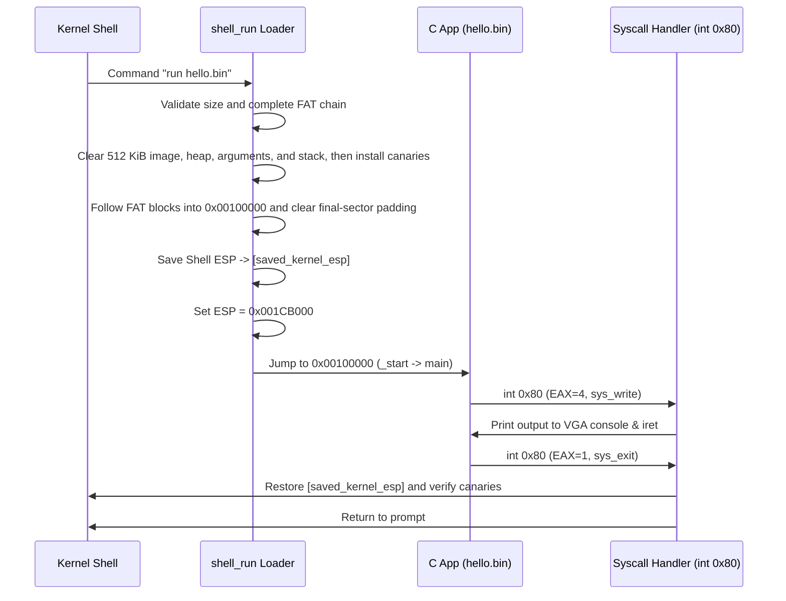

# MINI-OS C90 Application Development & Execution Guide

This guide explains how to write, compile, and execute C90 applications for **MINI-OS**.

## 1. Overview

MINI-OS supports executing trusted C applications written in **ANSI C (C90)**.

Application and executable-test source under `transport/apps/` and `transport/lib_test/` is compiled with strict C90 diagnostics (`-std=c90 -pedantic-errors -Wall -Wextra -Werror`).

The runtime implementation under `transport/lib/` intentionally uses modern C and is built separately.

Flat application binaries are loaded into the 512 KiB region at `0x00100000`, with a 32 KiB stack growing down from `0x001CB000`. System calls use the `int 0x80` trap gate, while hardware IRQs use interrupt gates and a separate 16 KiB interrupt stack.

Applications are not isolated processes. They execute in Ring 0 in the same flat address space as the kernel, so only trusted binaries should be run.

An application can access kernel memory and privileged instructions, and its fault can stop the entire system.

## 2. C90 Programming Guidelines for MINI-OS

### 2.1 C90 Language Constraints

When writing C code for MINI-OS, adhere strictly to C90 syntax:

- **Variable Declarations at Block Top**: All local variables must be declared at the beginning of a block before any executable statements.

  ```c
  /* Correct C90 */
  int main(void) {
      int i;
      int sum = 0;
      for (i = 0; i < 10; i++) {
          sum += i;
      }
      return 0;
  }
  ```

  *(Do not declare `for (int i = 0; ...)` inside the loop header).*

- **Block Comments**: Use standard C comments (`/* comment */`).
- **Dynamic Memory Allocation (`malloc`/`free`)**: Applications can dynamically allocate and free heap memory from `0x00180000` through the exclusive end `0x001C0000` using `sys_brk` (`EAX=12`).
- **No Floating-Point Operations**: The x87 FPU is not initialized in protected mode, so avoid `float` and `double` arithmetic.

### 2.2 Standard Library Support (`minilibc`)

Applications use a deliberately limited runtime through familiar C headers.

This is not a complete ANSI C library. The authoritative tested API, formatting conversions, stream behavior, and omissions are listed in [`Library_Support.md`](Library_Support.md).

The main supported groups are:

| Header | Key API Functions & Macros | Description |
| :--- | :--- | :--- |
| **`<stdlib.h>`** | `malloc`, `free`, `realloc`, `calloc`, `atoi`, `strtol`, `rand`, `srand`, `qsort`, `bsearch` | Dynamic heap allocation, string parsing, random generation, and sorting |
| **`<string.h>`** | `strcpy`, `strncpy`, `strcat`, `strcmp`, `strncmp`, `strchr`, `strstr`, `strtok`, `memset`, `memcpy`, `memmove`, `memcmp` | String manipulation and raw memory operations |
| **`<ctype.h>`** | `isalpha`, `isdigit`, `isalnum`, `isspace`, `islower`, `isupper`, `isprint`, `isgraph`, `ispunct`, `isxdigit`, `toupper`, `tolower` | ASCII character classification and case conversion |
| **`<stdio.h>`** | `printf`, `sprintf`, `snprintf`, `puts`, `getchar`, `putchar`, `fopen`, `fread`, `fwrite`, `fseek`, `fclose` | Formatted console I/O and syscall-backed file streams |
| **`<limits.h>`** | `INT_MAX`, `INT_MIN`, `CHAR_BIT`, `SHRT_MAX`, `LONG_MAX`, etc. | Data type limits and integer range constants |
| **`<stddef.h>`** | `size_t`, `ptrdiff_t`, `offsetof`, `NULL` | Standard type definitions and offset macros |
| **`<assert.h>`** | `assert(expression)` | Runtime assertion testing |

## 3. Directory Layout for User Applications & Tests

User applications, application tests, and C library tests are decoupled from the MINI-OS C standard library runtime:

```plaintext
transport/
├── lib/                     <-- MINI-OS C Runtime Library & Standard Headers
│   ├── crt0.asm             <-- Application Startup Entry (_start)
│   ├── compiler_rt.c        <-- Selected Network Build Compiler Helpers
│   ├── minilibc.h / .c      <-- Syscall & C Standard Library Implementation
│   ├── stdio.h / stdlib.h   <-- Standard Header Wrappers
│   ├── string.h / ctype.h
│   ├── limits.h / stddef.h / assert.h
│   ├── net/                 <-- Modern-C Network Implementation
│   └── ssh/                 <-- Modern-C SSH Implementation
├── apps/                    <-- User C Applications
│   ├── hello.c
│   ├── calc.c
│   ├── guess.c
│   ├── banner.c
│   ├── vedit.c
│   └── rawchat/             <-- Multi-Source Private Application Component
│       ├── main.c
│       ├── protocol.c
│       └── protocol.h
├── apps_test/               <-- Application-Specific Software Tests
│   └── rawchat/
│       ├── test_protocol.c
│       └── rawchat_qemu.py
├── lib_test/                <-- Dedicated C Library Test Suites
│   ├── test_string.c
│   ├── test_heap.c
│   ├── test_file.c
│   ├── test_no_space.c
│   ├── test_bss.c
│   ├── test_stack.c
│   └── test_guard.c
└── build/                   <-- Compiled Output Binaries
    ├── apps/                <-- User App Executables (hello.bin, calc.bin, etc.)
    └── lib_test/            <-- Test Executables for every lib_test source
```

### Writing a User Application (`transport/apps/hello.c`)

```c
#include "minilibc.h"

int main(void) {
    int count = 42;
    unsigned int hex_val = 0xFF;

    printf("Hello, World from C90 in MINI-OS!\n");
    printf("Test decimal: %d, Hexadecimal: 0x%x\n", count, hex_val);

    return 0;
}
```

## 4. Compilation and Transport Pipeline

MINI-OS uses an automated build toolchain:

```plaintext
[ transport/apps application sources ] ──> Clang (strict C90) ──> [ build/transport/apps object tree ]
                                                                            │
[ crt0.o + minilibc.o ] ───────────────────────> [ automatic ld.lld / elf2bin selection ]
                                                                            │
[ transport/build/apps/*.bin ] ──> [ inject_transport ] ──> [ /transport/ in mini_os.img ]
```

- **C Runtime Startup (`crt0.asm`)**:
  - `_start` executes at entry point `0x00100000`.
  - Calls `main()`.
  - Passes `main`'s return value to `sys_exit` via `int 0x80 (EAX=1)`.

- **Host Transport Injector (`tools/inject_transport.c`)**:
  - Built automatically during `make`.
  - Parses the MINI-OS disk image format.
  - Injects the `transport/` tree, including `transport/build/apps/*.bin`, at `/transport/` in `mini_os.img`.

## 5. Building and Running User Applications

### Option A: Build All Applications

To compile all C applications in `transport/apps/` and build the OS image:

```bash
make clean
make
```

### Option B: Build a Specific Application

To compile a specific application (e.g. `calc.c`):

```bash
make app APP=calc.c
```

For the multi-source Raw Chat application, use `make app APP=rawchat`.

### Step 2: Launch QEMU Emulator

```bash
make run
```

### Step 3: Execute User Binaries in MINI-OS Shell

- Navigate to the compiled binaries directory `/transport/build/apps`:

  ```text
  / > cd /transport/build/apps
  ```

- List compiled binaries:

  ```text
  /transport/build/apps > ls
  entries:
   - calc.bin (f)
   - guess.bin (f)
   - banner.bin (f)
   - hello.bin (f)
   - vedit.bin (f)
  ```

- Run an application:

  ```text
  /transport/build/apps > run calc.bin
  ```

### Expected Output in MINI-OS Console

```text
/transport/build/apps > run calc.bin
MINI_OS: launching app...
==========================================
   MINI-OS Interactive C90 Calculator
==========================================
Format: <num1> <op> <num2> (e.g. 12 + 34, 100 / 5)
Operators: +, -, *, / (Type 'q' to quit)

calc> 1+1
Result: 1 + 1 = 2

calc>
Calculator exiting...
MINI_OS: app exited cleanly.
/transport/build/apps >
```

## 6. Execution Flow & Architecture Breakdown



## 7. Memory Boundaries & Limitations

- **Executable Base**: `0x00100000`
- **Executable End (exclusive)**: `0x00180000`
- **Maximum Allocatable Image Footprint**: 512 KiB, including code, initialized data, and zero-initialized placement
- **Heap**: `0x00180000` through the exclusive end `0x001C0000`
- **Argument Strings / `argv`**: the 4 KiB block `0x001C1000..0x001C1FFF`
- **Application Stack**: `0x001C3000..0x001CAFFF`, growing down from `0x001CB000`
- **System Call ABI**: register inputs, return values, flags, and all implemented call numbers are specified in [`Syscall_ABI.md`](Syscall_ABI.md).

  Applications execute in Ring 0, so the ABI organizes services but provides no pointer or privilege isolation.

The loader clears the full executable region before each run so zero-initialized static storage starts at zero. The flat-binary producer must preserve section placement so every zero-initialized symbol remains inside the 512 KiB application image.

`ld.lld --oformat binary` may omit trailing zero-only bytes; this is safe because the loader clears the entire image.

The `elf2bin` fallback explicitly materializes `SHT_NOBITS` placement and checks its output capacity.

The format has no runtime relocation or segment metadata.

Application startup calls `main` directly and does not run constructor or destructor arrays. Both flat-binary producers therefore reject nonempty `.preinit_array`, `.init_array`, `.fini_array`, `.ctors`, and `.dtors` sections instead of silently producing an executable with incomplete startup semantics.

The runtime also has no thread-pointer setup, so both producers reject thread-local storage sections instead of accepting code whose TLS addresses would be invalid.

The executable regression `transport/lib_test/test_bss.c` checks 12 KiB of zero-initialized static arrays and their writability. Run it with:

```text
run /transport/build/lib_test/test_bss.bin
```

The executable regression `transport/lib_test/test_stack.c` actively uses 28 KiB of the 32 KiB application stack, and the kernel verifies the adjacent canary before returning to the shell.

The negative regression `transport/lib_test/test_guard.c` selects and corrupts each kernel-stack, interrupt-stack, application-heap, and application-stack canary in a separate isolated boot and proves that every case enters the kernel's non-returning memory-failure path.
